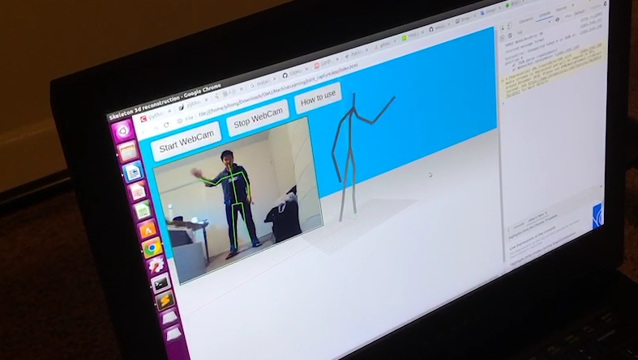

# 3D Human Pose Estimation Using Single RGB Camera



## Demo usage

1. Clone project

   ```
   git clone https://github.com/zhengxiangyue/joint_capture.git
   cd joint_capture
   ```

2. Download dataset and model [Human36m](https://drive.google.com/file/d/1IbVK2fXcr77JyI_ntyRV6OvoLwoMSq3a/view) and put `data` folder in `joint_capture`

3. Open server

   ```
   python service.py
   ```

4. Open demo in browser `app/index.html`

## Dataset

Human3.6M
## Dependencies
Pytorch >= 0.3.0
## Training usage
Download the pre-processed [Human36m](https://drive.google.com/file/d/1IbVK2fXcr77JyI_ntyRV6OvoLwoMSq3a/view) dataset in 3d joints:

```
unzip human36m.zip
rm h36m.zip
```

### Test
`python 3d_pose_detection.py --test --load ./checkpoint/ckpt_60.pth.tar`